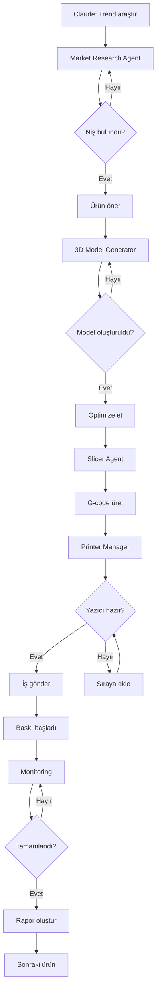

# 🏭 3D Print Automation Ecosystem

**Claude Desktop ile Tam Otomasyonlu 3D Baskı İş Akışı**

Bu proje, 3D baskı sektöründe baştan sona tam otomasyonlu bir ekosistem sunar:
- 🔍 Pazar araştırması ve trend analizi
- 🎯 Niş belirleme ve ürün seçimi
- 🎨 Otomatik 3D model üretimi
- ⚙️ Baskı optimizasyonu
- 🖨️ Yazıcı yönetimi ve iş takibi

---

## 🎯 Özellikler

### 1️⃣ Market Research Agent (MCP Server)
**Fonksiyon:** İnternetten ürün, fiyat ve pazar araştırması

**Yetenekler:**
- 🌐 E-ticaret sitelerinden trend analizi (Etsy, Amazon, Thingiverse)
- 💰 Fiyat karşılaştırma ve rekabet analizi
- 📊 Google Trends entegrasyonu
- 🎯 Niş fırsat tespiti
- 📈 Satış potansiyeli skorlama
- 🔎 Keyword ve SEO analizi

**Araçlar:**
- `search_products` - Ürün araştırması
- `analyze_trends` - Trend analizi
- `compare_prices` - Fiyat karşılaştırma
- `find_niche_opportunities` - Niş fırsatlar
- `get_market_report` - Detaylı pazar raporu

---

### 2️⃣ 3D Model Generator Agent (MCP Server)
**Fonksiyon:** Blender ve Hyper3D API ile model üretimi

**Yetenekler:**
- 🎨 Blender Python API entegrasyonu
- 🤖 Hyper3D AI model generation
- 📐 Parametrik model oluşturma
- 🔧 Model düzenleme ve optimize etme
- 📦 STL/OBJ/FBX export
- 🖼️ Render ve önizleme

**Araçlar:**
- `generate_model_with_ai` - AI ile model üret (Hyper3D)
- `create_parametric_model` - Parametrik model oluştur
- `import_model` - Model import et
- `edit_model` - Model düzenle
- `optimize_for_printing` - Baskı için optimize et
- `export_model` - Model export et
- `render_preview` - Önizleme render et

---

### 3️⃣ Bambu Lab Slicer Agent (MCP Server)
**Fonksiyon:** Otomatik slicer ayarları ve optimize etme

**Yetenekler:**
- ⚙️ Bambu Studio CLI entegrasyonu
- 🎯 Otomatik baskı profili seçimi
- 🔧 Destek yapısı optimizasyonu
- 📊 Maliyet ve süre hesaplama
- 🎨 Çoklu materyal desteği
- 📈 Kalite vs hız optimizasyonu

**Araçlar:**
- `slice_model` - Model slice et
- `optimize_supports` - Destek optimize et
- `calculate_cost` - Maliyet hesapla
- `estimate_time` - Süre tahmini
- `preview_layers` - Layer önizleme
- `export_gcode` - G-code export

---

### 4️⃣ Bambu Lab Printer Manager (MCP Server)
**Fonksiyon:** Yazıcı kontrolü ve iş takibi

**Yetenekler:**
- 🖨️ Bambu Lab A1 API entegrasyonu
- 📡 Yerel ağ üzerinden kontrol
- 📤 İş gönderme ve sıralama
- 📊 Gerçek zamanlı durum takibi
- 📹 Kamera görüntüsü
- 🔔 Bildirimler ve uyarılar
- 📈 İstatistikler ve raporlama

**Araçlar:**
- `send_job` - İş gönder
- `get_printer_status` - Yazıcı durumu
- `get_job_queue` - İş sırası
- `monitor_progress` - İlerleme takibi
- `get_camera_snapshot` - Kamera görüntüsü
- `pause_resume_job` - İşi duraklat/devam et
- `cancel_job` - İşi iptal et
- `get_statistics` - İstatistikler

---

### 5️⃣ Workflow Orchestrator (Ana Koordinatör)
**Fonksiyon:** Tüm süreci yöneten akıllı koordinatör

**Yetenekler:**
- 🎯 End-to-end workflow yönetimi
- 🤝 Tüm MCP sunucuları koordine eder
- 📊 Karar verme ve optimizasyon
- 💾 Proje ve veri yönetimi
- 📝 Raporlama ve loglama
- 🔄 Hata yönetimi ve retry

**İş Akışı:**
```
1. Pazar Araştırması → Niş Belirleme
2. Ürün Seçimi → 3D Model Üretimi
3. Model Optimizasyonu → Slicing
4. Baskı Ayarları → İş Gönderme
5. Takip ve Raporlama
```

---

## 🏗️ Sistem Mimarisi

```
┌─────────────────────────────────────────────────────────────┐
│                     Claude Desktop (Ana Agent)               │
│                  "Etsy'de trend ürünleri araştır,           │
│                   3D model oluştur ve yazdır"                │
└────────────────────────────┬────────────────────────────────┘
                             │ MCP Protocol
                             ▼
┌─────────────────────────────────────────────────────────────┐
│              MCP Servers (Windows 11 - Python)               │
│                                                               │
│  ┌──────────────┐  ┌──────────────┐  ┌──────────────┐      │
│  │   Market     │  │  3D Model    │  │   Slicer     │      │
│  │  Research    │  │  Generator   │  │   Agent      │      │
│  └──────┬───────┘  └──────┬───────┘  └──────┬───────┘      │
│         │                  │                  │               │
│  ┌──────┴────────┐  ┌─────┴────────┐  ┌─────┴────────┐     │
│  │   Printer     │  │   Workflow   │  │   Database   │     │
│  │   Manager     │  │ Orchestrator │  │   Manager    │     │
│  └──────┬────────┘  └──────────────┘  └──────────────┘     │
└─────────┼───────────────────────────────────────────────────┘
          │
          │ HTTP/WebSocket/COM
          ▼
┌─────────────────────────────────────────────────────────────┐
│              External Systems & Software                     │
│                                                               │
│  🌐 Web APIs         🎨 Blender         ⚙️ Bambu Studio     │
│  - Google Trends     - Python API      - CLI Interface       │
│  - Etsy API          - bpy module                            │
│  - Amazon API                                                │
│                                                               │
│  🤖 Hyper3D API      🖨️ Bambu Lab A1                        │
│  - Model Generation  - Network API                           │
│                      - Camera Stream                         │
└─────────────────────────────────────────────────────────────┘
```

---

## 🚀 Hızlı Kurulum (Windows 11)

### Ön Gereksinimler

1. **Python 3.10+**
   ```powershell
   python --version
   ```

2. **Claude Desktop**
   - [İndir](https://claude.ai/desktop)

3. **Blender**
   - [İndir](https://www.blender.org/download/)
   - PATH'e ekle

4. **Bambu Studio**
   - [İndir](https://bambulab.com/en/download/studio)

5. **Git**
   ```powershell
   git --version
   ```

### Kurulum Adımları

```powershell
# 1. Repository'yi klonlayın
git clone <repo-url> %USERPROFILE%\3d-print-ecosystem
cd %USERPROFILE%\3d-print-ecosystem

# 2. Python bağımlılıklarını yükleyin
python -m pip install --upgrade pip
pip install -r requirements.txt

# 3. Otomatik kurulum scriptini çalıştırın
python install_3d_ecosystem.py

# 4. Konfigürasyon dosyasını düzenleyin
notepad config.yaml

# 5. Claude Desktop'ı yeniden başlatın

# 6. Test edin!
```

### Manuel Kurulum

Eğer otomatik kurulum çalışmazsa:

```powershell
# MCP config dosyasını düzenleyin
notepad %APPDATA%\Claude\claude_desktop_config.json
```

Aşağıdaki yapılandırmayı ekleyin:

```json
{
  "mcpServers": {
    "3d-print-market-research": {
      "command": "python",
      "args": [
        "C:\\Users\\YourUsername\\3d-print-ecosystem\\market_research_server.py"
      ],
      "env": {
        "PYTHONUNBUFFERED": "1"
      }
    },
    "3d-print-model-generator": {
      "command": "python",
      "args": [
        "C:\\Users\\YourUsername\\3d-print-ecosystem\\model_generator_server.py"
      ],
      "env": {
        "PYTHONUNBUFFERED": "1",
        "BLENDER_PATH": "C:\\Program Files\\Blender Foundation\\Blender 4.0\\blender.exe"
      }
    },
    "3d-print-slicer": {
      "command": "python",
      "args": [
        "C:\\Users\\YourUsername\\3d-print-ecosystem\\slicer_server.py"
      ],
      "env": {
        "PYTHONUNBUFFERED": "1",
        "BAMBU_STUDIO_PATH": "C:\\Program Files\\BambuStudio\\bambu-studio.exe"
      }
    },
    "3d-print-printer-manager": {
      "command": "python",
      "args": [
        "C:\\Users\\YourUsername\\3d-print-ecosystem\\printer_manager_server.py"
      ],
      "env": {
        "PYTHONUNBUFFERED": "1"
      }
    },
    "3d-print-orchestrator": {
      "command": "python",
      "args": [
        "C:\\Users\\YourUsername\\3d-print-ecosystem\\workflow_orchestrator_server.py"
      ],
      "env": {
        "PYTHONUNBUFFERED": "1"
      }
    }
  }
}
```

---

## 🎯 Kullanım Örnekleri

### Senaryo 1: Sıfırdan Ürün Geliştirme

```
Claude'a sor:
"3D baskı için popüler ve karlı nişleri araştır"

→ Market Research Agent aktif
→ Etsy, Amazon, Thingiverse analiz edilir
→ Trend raporu sunulur

"En iyi 3 niş için birer ürün örneği oluştur"

→ 3D Model Generator aktif
→ Hyper3D AI ile modeller üretilir
→ Blender'da optimize edilir

"Tüm modelleri Bambu Lab A1 için slice et"

→ Slicer Agent aktif
→ Optimal ayarlar belirlenir
→ G-code'lar hazırlanır

"İlk modeli yazdır"

→ Printer Manager aktif
→ İş gönderilir
→ Durum takibi başlar
```

---

### Senaryo 2: Trend Takibi ve Hızlı Üretim

```
"Etsy'de bu hafta trend olan ürünleri bul"

→ Market Research Agent
→ Güncel trendler listelenir

"En popüler ürün için benzer bir model oluştur"

→ Model Generator aktif
→ AI ile model üretilir
→ Otomatik optimize

"Hızlı baskı modunda yazdır"

→ Slicer: Hız optimizasyonu
→ Printer: İş gönderimi
```

---

### Senaryo 3: Batch Üretim

```
"Christmas dekorasyon kategorisinde 10 farklı ürün bul"

→ Market Research: Kategori analizi

"Her biri için 3D model oluştur ve toplu yazdırmaya hazırla"

→ Model Generator: 10 model üretimi
→ Slicer: Toplu slice
→ Printer: İş sırası oluştur

"Tüm işleri sıraya ekle ve maliyet/süre raporu ver"

→ Workflow Orchestrator koordine eder
→ Detaylı rapor sunulur
```

---

## 📊 Özellik Matrisi

| Özellik | Market Research | Model Generator | Slicer | Printer Manager | Orchestrator |
|---------|----------------|-----------------|--------|-----------------|--------------|
| **Web Scraping** | ✅ | ❌ | ❌ | ❌ | ✅ |
| **Trend Analysis** | ✅ | ❌ | ❌ | ❌ | ✅ |
| **AI Model Gen** | ❌ | ✅ | ❌ | ❌ | ✅ |
| **Blender API** | ❌ | ✅ | ❌ | ❌ | ❌ |
| **Slicing** | ❌ | ❌ | ✅ | ❌ | ✅ |
| **Cost Calculate** | ✅ | ❌ | ✅ | ✅ | ✅ |
| **Job Queue** | ❌ | ❌ | ❌ | ✅ | ✅ |
| **Live Monitoring** | ❌ | ❌ | ❌ | ✅ | ✅ |
| **Reporting** | ✅ | ✅ | ✅ | ✅ | ✅ |

---

## 🔧 Konfigürasyon

### `config.yaml`

```yaml
# Pazar Araştırması
market_research:
  etsy_api_key: "your_etsy_api_key"
  google_trends_enabled: true
  scraping_enabled: true
  cache_duration_hours: 24

# 3D Model Generation
model_generation:
  blender_executable: "C:\\Program Files\\Blender Foundation\\Blender 4.0\\blender.exe"
  hyper3d_api_key: "your_hyper3d_api_key"
  output_directory: "C:\\Users\\YourName\\3D_Models"
  default_format: "stl"

# Slicer
slicer:
  bambu_studio_path: "C:\\Program Files\\BambuStudio\\bambu-studio.exe"
  default_printer: "Bambu Lab A1"
  default_material: "PLA"
  output_directory: "C:\\Users\\YourName\\GCode"

# Printer
printer:
  bambu_a1_ip: "192.168.1.100"
  bambu_a1_access_code: "your_access_code"
  camera_enabled: true
  notification_enabled: true

# Workflow
workflow:
  auto_mode: false
  database_path: "C:\\Users\\YourName\\3d_print_ecosystem\\data\\projects.db"
  log_level: "INFO"
```

---

## 📁 Proje Yapısı

```
3d-print-ecosystem/
│
├── mcp_servers/
│   ├── market_research_server.py       # MCP: Pazar araştırması
│   ├── model_generator_server.py       # MCP: 3D model üretimi
│   ├── slicer_server.py                # MCP: Slicing
│   ├── printer_manager_server.py       # MCP: Yazıcı yönetimi
│   └── workflow_orchestrator_server.py # MCP: Koordinatör
│
├── modules/
│   ├── market_research/
│   │   ├── etsy_scraper.py
│   │   ├── amazon_scraper.py
│   │   ├── trends_analyzer.py
│   │   └── niche_finder.py
│   │
│   ├── model_generation/
│   │   ├── blender_controller.py
│   │   ├── hyper3d_client.py
│   │   ├── model_optimizer.py
│   │   └── parametric_models.py
│   │
│   ├── slicer/
│   │   ├── bambu_studio_cli.py
│   │   ├── profile_optimizer.py
│   │   └── support_generator.py
│   │
│   ├── printer/
│   │   ├── bambu_api.py
│   │   ├── job_manager.py
│   │   └── monitor.py
│   │
│   └── workflow/
│       ├── orchestrator.py
│       ├── decision_engine.py
│       └── database.py
│
├── scripts/
│   ├── install_3d_ecosystem.py         # Otomatik kurulum
│   ├── test_all_servers.py             # Test suite
│   └── setup_windows.ps1               # Windows setup
│
├── config/
│   ├── config.yaml                     # Ana konfigürasyon
│   ├── printer_profiles.json           # Yazıcı profilleri
│   └── material_settings.json          # Materyal ayarları
│
├── data/
│   ├── projects.db                     # SQLite database
│   └── cache/                          # Cache dizini
│
├── docs/
│   ├── 3D_PRINT_ECOSYSTEM_README.md    # Bu dosya
│   ├── SETUP_GUIDE_WINDOWS.md          # Windows kurulum
│   ├── API_REFERENCE.md                # API dokümantasyonu
│   └── EXAMPLES.md                     # Kullanım örnekleri
│
├── requirements.txt                    # Python bağımlılıkları
├── .env.example                        # Environment variables
└── README.md                           # Kısa açıklama
```

---

## 🔌 API Entegrasyonları

### 1. Hyper3D API
```python
# Model generation örneği
hyper3d_client.generate(
    prompt="Modern minimalist plant pot with drainage hole",
    style="parametric",
    optimization="printable"
)
```

### 2. Bambu Lab API
```python
# Yazıcıya iş gönderme
bambu_api.send_job(
    printer_ip="192.168.1.100",
    gcode_path="output.gcode",
    priority="normal"
)
```

### 3. Blender Python API
```python
# Model import ve düzenleme
import bpy
bpy.ops.import_mesh.stl(filepath="model.stl")
bpy.ops.object.modifier_add(type='SOLIDIFY')
```

---

## 🎓 İş Akışı Detayları

### Tam Otomasyon Workflow



---

## 💡 Gelişmiş Özellikler

### 1. Akıllı Karar Verme
- **Maliyet Optimizasyonu:** En ucuz materyal/ayar kombinasyonu
- **Hız Optimizasyonu:** Kalite korunarak maksimum hız
- **Kalite Optimizasyonu:** En yüksek kalite için profil seçimi

### 2. Otomatik Niş Keşfi
```python
# AI destekli niş bulma
niche_finder.analyze(
    platforms=["etsy", "amazon", "thingiverse"],
    criteria={
        "competition": "low",
        "demand": "high",
        "profit_margin": ">50%"
    }
)
```

### 3. Batch Processing
```python
# 10 farklı ürünü aynı anda işle
batch_processor.process(
    products=product_list,
    parallel_models=3,
    auto_queue=True
)
```

### 4. Real-time Dashboard
```python
# Web-based monitoring dashboard
dashboard.start(port=8080)
# http://localhost:8080
```

---

## 📈 Performans ve Limitler

| Metrik | Değer |
|--------|-------|
| **Maks. Eşzamanlı Model Üretimi** | 5 |
| **Maks. İş Sırası** | 50 |
| **Pazar Araştırma Hızı** | ~100 ürün/dk |
| **Model Generation Süresi** | 2-5 dk (AI) |
| **Slicing Süresi** | 10-60 sn |
| **API Rate Limits** | Hyper3D: 10/dk |

---

## 🛡️ Güvenlik

- ✅ API anahtarları `.env` dosyasında
- ✅ Yerel ağda yazıcı iletişimi
- ✅ Sensitive data encryption
- ✅ Audit logging
- ✅ Rate limiting

---

## 🐛 Sorun Giderme

### "Blender bulunamadı"
```powershell
# PATH'e ekle veya config.yaml'da tam yolu belirt
$env:PATH += ";C:\Program Files\Blender Foundation\Blender 4.0"
```

### "Bambu Lab yazıcıya bağlanılamadı"
- Yazıcı ve bilgisayar aynı ağda mı?
- Access code doğru mu?
- Yazıcı LAN Mode aktif mi?

### "Hyper3D API hatası"
- API key doğru mu?
- Rate limit aşıldı mı?
- İnternet bağlantısı var mı?

---

## 🚀 Gelecek Özellikler

- [ ] **Multi-printer support** - Birden fazla yazıcı yönetimi
- [ ] **Cloud sync** - Bulut entegrasyonu
- [ ] **Mobile app** - Mobil izleme
- [ ] **AI quality control** - Kamera ile kalite kontrolü
- [ ] **Cost tracking** - Detaylı maliyet takibi
- [ ] **Inventory management** - Materyal stok yönetimi
- [ ] **Etsy/Shopify direct integration** - Satış entegrasyonu

---

## 📞 Destek

1. **Dokümantasyon:** `docs/` klasörüne bakın
2. **Debug:** Python sunucularını manuel çalıştırın
3. **Loglar:** `data/logs/` klasöründe
4. **Community:** GitHub Discussions

---

## 📄 Lisans

MIT

---

## 🎉 Başlayalım!

```powershell
# Hemen başlamak için:
git clone <repo>
cd 3d-print-ecosystem
python install_3d_ecosystem.py
```

**Claude Desktop'ta yazın:**
```
"3D baskı ekosistemimi test et"
```

**Görmelisiniz:**
- ✅ 5 MCP server aktif
- ✅ ~30+ araç hazır
- ✅ Tam otomasyon ready!

---

**Başarılar! İşinizi otomatikleştirin ve büyütün! 🚀🖨️✨**
